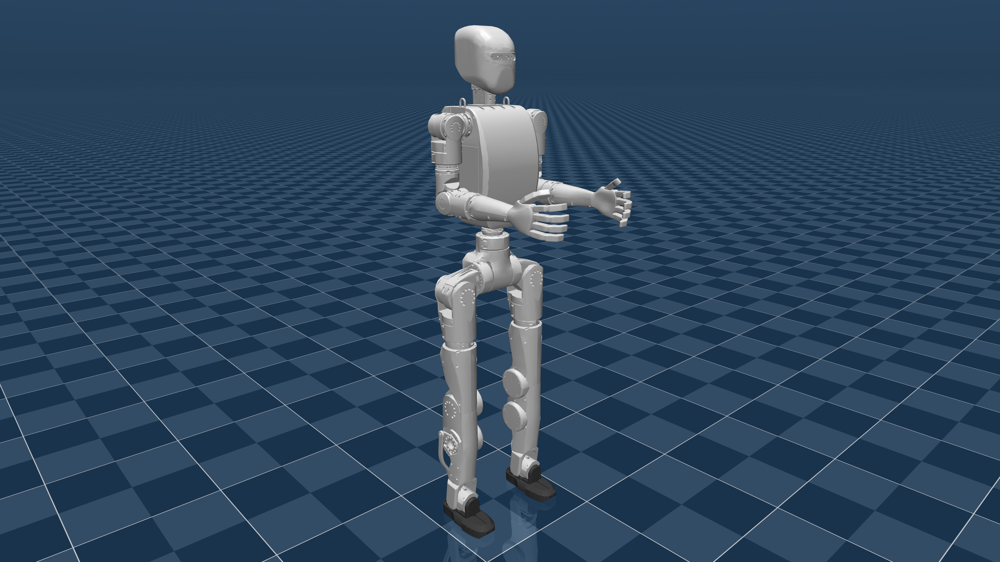

# ROBOTIS AI Sapiens K1 Description (MJCF)

> [!IMPORTANT]
> Requires MuJoCo 3.0.0 or later.

## Changelog

See [CHANGELOG.md](./CHANGELOG.md) for a full history of changes.

## Overview

This package contains a simplified robot description (MJCF) of the
[ROBOTIS AI Sapiens K1](https://docs.robotis.com/docs/systems/aisapiens/introduction/)
humanoid robot developed by [ROBOTIS](https://www.robotis.com/). It is derived
from the K1 URDF in the `ai_sapiens_description` package of the
[ai_sapiens](https://github.com/ROBOTIS-GIT/ai_sapiens) repository.

  

## URDF → MJCF derivation steps

1. Started from the K1 URDF in the `ai_sapiens_description` package.
2. Added a `<mujoco>` compiler directive with `discardvisual="false"` to the URDF and resolved the ROS package mesh paths.
3. Loaded the URDF into MuJoCo and saved the corresponding MJCF.
4. Added a free joint and an IMU site to the pelvis.
5. Added motor actuators with torque limits and armature values from the actuator specifications.
6. Set the integrator to `implicitfast`.
7. Added orientation, gyroscope, and accelerometer sensors for the IMU.
8. Added a home keyframe.
9. Added `scene.xml` with the ground plane, lighting, skybox, and haze.

## License

This model is released under an [Apache-2.0 License](LICENSE).
