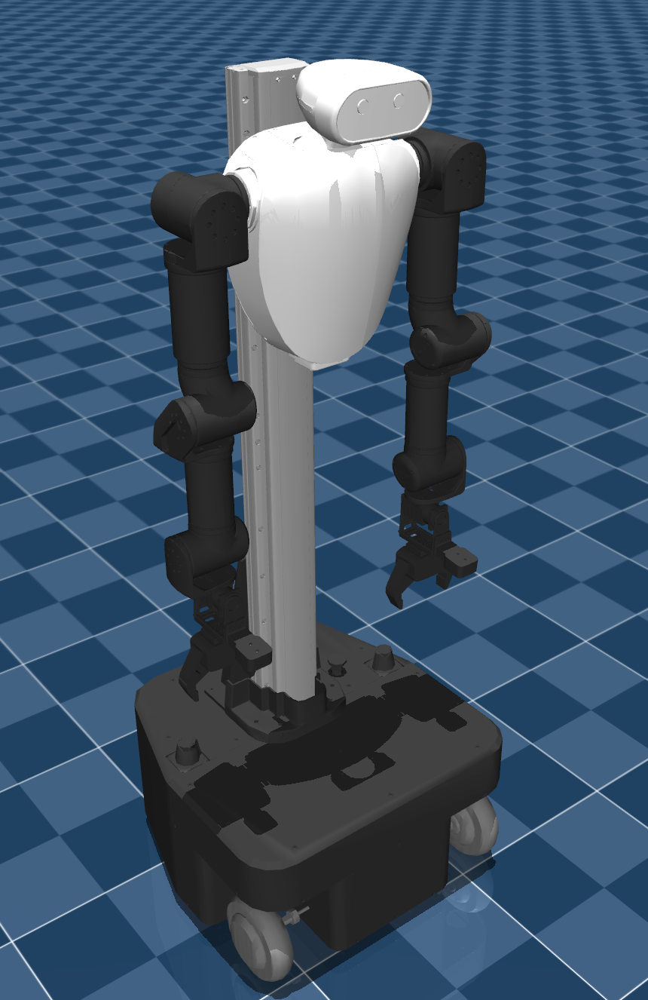
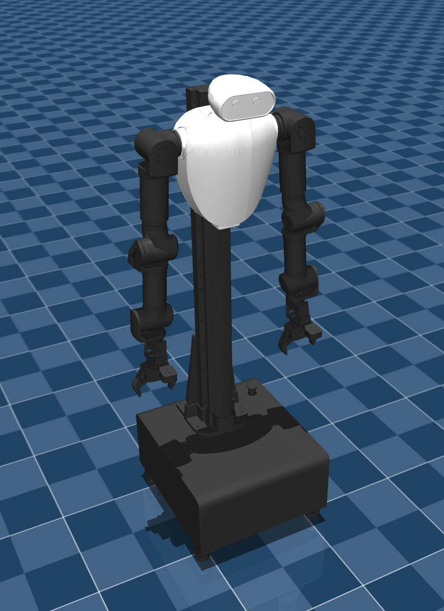

# ROBOTIS AI Worker (FFW) Description (MJCF)

> [!IMPORTANT]
> Requires MuJoCo 2.2.2 or later.

## Changelog

See [CHANGELOG.md](./CHANGELOG.md) for a full history of changes.

## Overview

This package contains a simplified robot description (MJCF) of the [ROBOTIS AI Worker](https://ai.robotis.com/ai_worker/introduction_ai_worker.html) developed by [ROBOTIS](https://robotis.com/). The AI Worker is a humanoid robot equipped with a swerve-drive–type mobile base, designed for industrial and research applications.

Two variants are available:
- **FFW-SG2**: Equipped with the RH-P12-RN(A) gripper
- **FFW-BG2**: Equipped with the RH-P12-RN2 gripper

  
  

## URDF → MJCF derivation steps

1. Processed carefully prepared URDF files from ROBOTIS.
2. Loaded the URDF into MuJoCo and carefully edited the MJCF.
3. Added `scene_ffw_sg2.xml` and `scene_ffw_bg2.xml` which includes the robot, ground plane, and all necessary simulation elements.

## License

This model is released under an [Apache-2.0 License](LICENSE).
