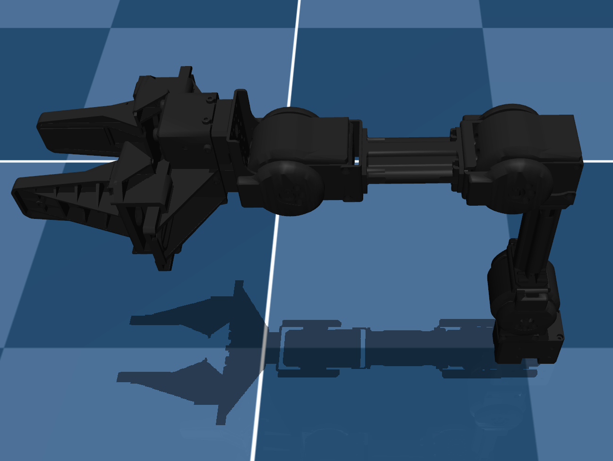

# ROBOTIS OpenMANIPULATOR-X Description (MJCF)

> [!IMPORTANT]
> Requires MuJoCo 2.2.2 or later.

## Changelog

See [CHANGELOG.md](./CHANGELOG.md) for a full history of changes.

## Overview

This package contains a simplified robot description (MJCF) of the [ROBOTIS OpenMANIPULATOR-X](https://emanual.robotis.com/docs/en/platform/openmanipulator_x/overview/) developed by [ROBOTIS](https://robotis.com/). The OpenMANIPULATOR-X is a fixed-base robotic manipulator designed to perform a wide range of manipulation tasks in research and industrial environments.

  

## URDF → MJCF derivation steps

1. Processed carefully prepared URDF files from ROBOTIS.
2. Loaded the URDF into MuJoCo and carefully edited the MJCF.
3. Added `scene.xml` which includes the robot, ground plane, and all necessary simulation elements.

## License

This model is released under an [Apache-2.0 License](LICENSE).
