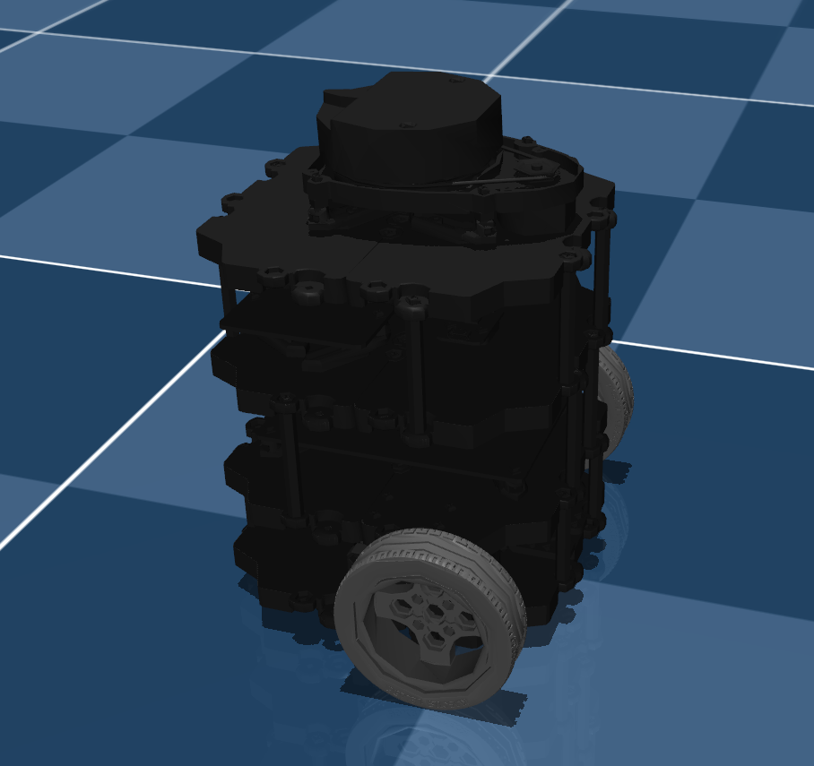
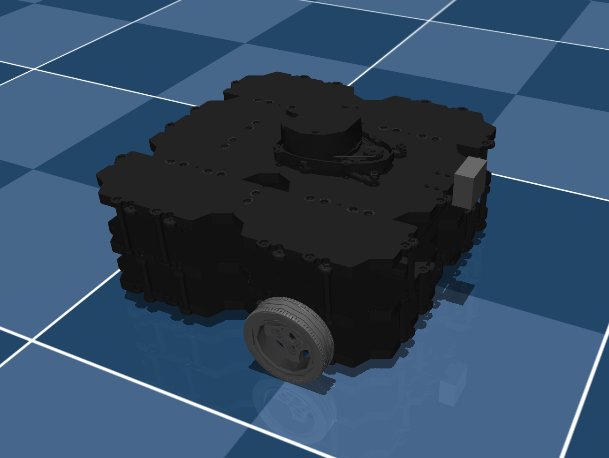

# ROBOTIS TurtleBot3 Description (MJCF)

> [!IMPORTANT]
> Requires MuJoCo 2.2.2 or later.

## Changelog

See [CHANGELOG.md](./CHANGELOG.md) for a full history of changes.

## Overview

This package contains a simplified robot description (MJCF) of the [ROBOTIS TurtleBot3](https://emanual.robotis.com/docs/en/platform/turtlebot3/overview/) developed by [ROBOTIS](https://robotis.com/). TurtleBot3 is a small, affordable, programmable, ROS-based mobile robot for use in education, research, hobby, and product prototyping.

Two variants are available:
- **TurtleBot3 Burger**: Compact and affordable variant
- **TurtleBot3 Waffle Pi**: Larger variant with additional sensors

  
  

## URDF → MJCF derivation steps

1. Processed carefully prepared URDF files from ROBOTIS.
2. Loaded the URDF into MuJoCo and carefully edited the MJCF.
3. Added `scene_turtlebot3_burger.xml` and `scene_turtlebot3_waffle_pi.xml` which include the robot, ground plane, and all necessary simulation elements.

## License

This model is released under an [Apache-2.0 License](LICENSE).
